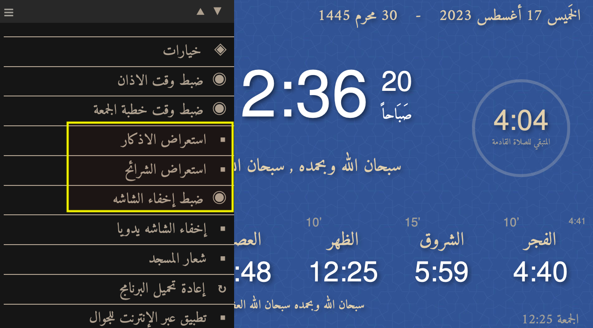

# To explain the functionalities as below:

## Main Task is update those features from the Tawkit 9.31 to 9.51

### Those feature need to apply in the new version

1. The first one has the purpose to show Azkar (Pictures) after the prayer. And you specify the time how long time you want to show them.

2. The next one has exactly the same purpose to show another type of Azkar (pictures) after the specified time for the first functionality has passed. And the pictures are shown 20 seconds each

3. The third one is to black out the screen/ hide the screen and you have the ability to activate that 35 minutes after the sun rise. And for Fridays prayer you can choose the time to hide it before the prayer and show it after it based on the time entered. And lastly you can hide the screen during the prayer and you select the time you wish for each prayer
